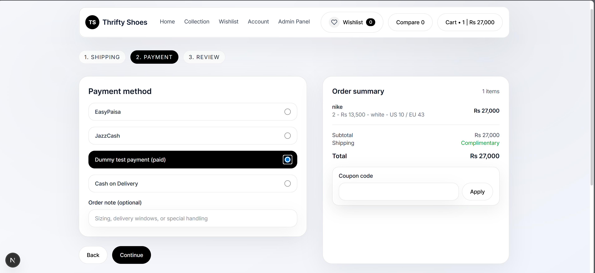
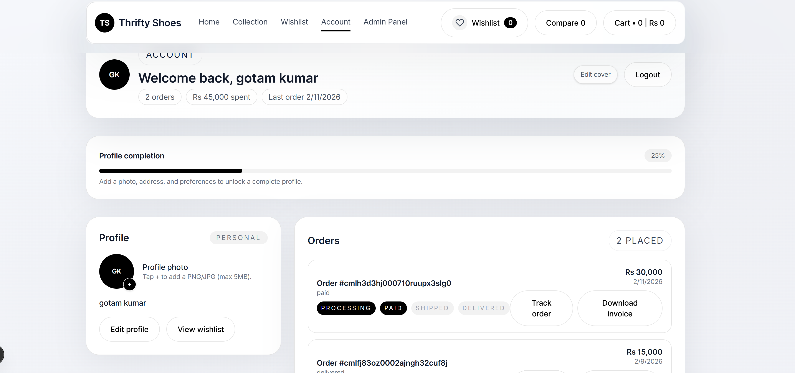
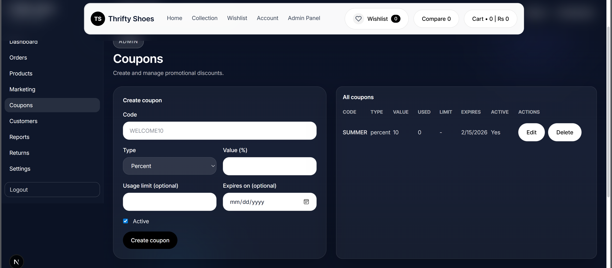

# Thrifty Shoes — E‑Commerce Platform


Production‑style footwear commerce app with a modern storefront and a full admin control center.

## Overview
- Customer storefront (browse, compare, wishlist, cart, checkout)
- Account area (profile, orders, activity, security)
- Admin dashboard (products, orders, customers, coupons, marketing, returns, reports)

## Highlights
- Clean, premium UI with consistent components
- Admin workflows for catalog, marketing, and operations
- OTP‑based email verification for registration
- Google login (OAuth) ready
- Optional SMS/email notifications (Twilio/SMTP)

## Features

Storefront
- Product catalog, collections, and product details
- Compare and wishlist (including shareable wishlist)
- Cart and checkout flows

Account
- OTP register, login, and forgot password pages
- Orders list and order detail page

Admin
- Dashboard widgets and analytics views
- Product, order, customer, coupon, marketing, returns, and settings pages

## Tech Stack

Frontend
- Next.js (App Router), React, Tailwind CSS, Redux Toolkit

Backend
- Node.js, Express, Prisma

Optional Services (configured via env)
- Clerk (auth), Cloudinary (media), Twilio (SMS), Nodemailer/SMTP (email)

## What Is Not Included

- Real payment gateway integration (only the flow UI and backend structure)
- Production deployment configs
- Real production secrets (intentionally excluded)

## Screenshots

Add your screenshots to `screenshots/` using the filenames below.

| Page | Screenshot |
| --- | --- |
| Home |  |
| Product |  |
| Cart |  |
| Checkout |  |
| Payment |  |
| Customer Profile |  |
| Admin Dashboard |  |
| Coupons |  |

### Screenshot Descriptions
- Home: Hero carousel, curated collections, and primary CTA flow.
- Product: Gallery, variants, sizes, and purchase actions.
- Cart: Editable line items, totals, and checkout CTA.
- Checkout: Shipping, payment, and review steps.
- Payment: Method selection and validation view.
- Customer Profile: Orders, preferences, and account tools in one place.
- Admin Dashboard: KPI cards, recent orders, and operational tables.
- Coupons: Create/edit promotional discounts and track usage.

## Project Structure

```text
/
  src/                 Next.js app (storefront + admin UI)
  public/              Static assets
  backend/             Express API + Prisma schema/migrations
```

## Getting Started

### 1) Frontend

```bash
npm install
npm run dev
```

App runs at `http://localhost:3000`.

### 2) Backend

```bash
cd backend
npm install
npm run prisma:generate
npm run prisma:migrate
npm run dev
```

API runs at `http://localhost:5000`.

## Environment Variables

### Frontend (`.env.local`)

```bash
NEXT_PUBLIC_API_BASE=http://localhost:5000
NEXT_PUBLIC_ADMIN_BYPASS=dev-admin
NEXT_PUBLIC_GOOGLE_CLIENT_ID=your_google_client_id
```

### Backend (`backend/.env`)

Use `backend/.env.example` as a template.

Required for local dev:
- `DATABASE_URL`
- `JWT_SECRET`

Optional services:
- `CLERK_*`
- `CLOUDINARY_*`
- `SMTP_*`
- `TWILIO_*`
- `GOOGLE_CLIENT_ID`
- `GOOGLE_CLIENT_SECRET`
- `GOOGLE_REDIRECT_URL`

## Security Notes
- Admin routes are role‑protected on the API.
- OTP registration is rate‑limited and expires automatically.
- Do not commit secrets; use `.env` files locally.

## Scripts

Frontend:

```bash
npm run dev
npm run build
npm run start
```

Backend:

```bash
npm run dev
npm run build
npm run start
```


## API Notes
- Base URL: `http://localhost:5000`
- REST endpoints are under `/auth`, `/products`, `/orders`, `/admin`, `/settings`, etc.
- Admin routes require an admin role JWT.
