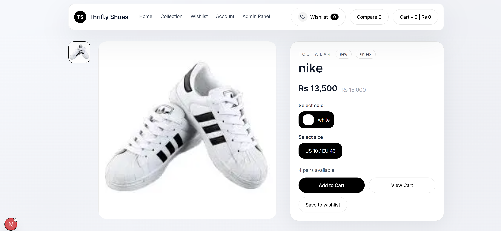
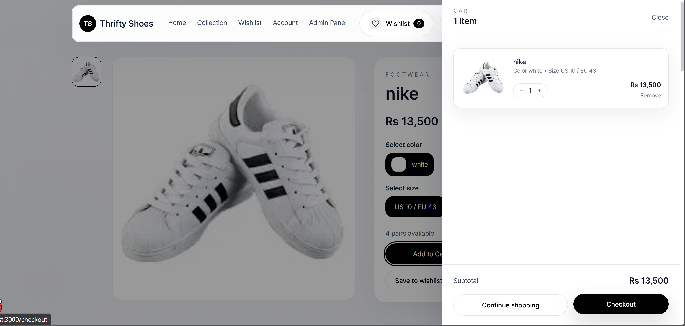
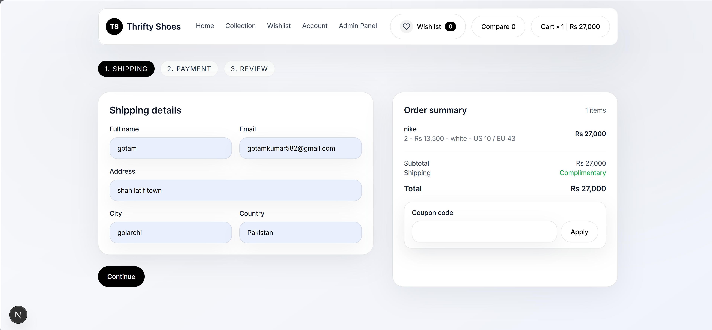
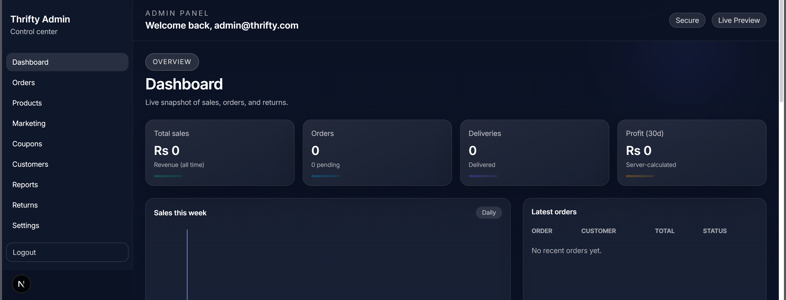

# Shoe Commerce Platform

Production-style e-commerce app built with Next.js, Express, and Prisma.

## Screenshots

Add your screenshots to `screenshots/` and update the paths below.







## Features

- Product catalog, product details, and collections
- Cart, wishlist (including shareable wishlist), and product compare
- Checkout flow and order tracking
- User auth pages (login, register, forgot password)
- Admin dashboard for products, orders, customers, coupons, reports, and marketing

## Tech Stack

- Frontend: Next.js (App Router), React, Tailwind CSS, Redux Toolkit
- Backend: Node.js, Express, Prisma
- Services: Cloudinary, Clerk, Twilio, Nodemailer (configurable)

## Getting Started

### 1) Frontend

```bash
npm install
npm run dev
```

App runs at `http://localhost:3000`.

### 2) Backend

```bash
cd backend
npm install
npm run prisma:generate
npm run prisma:migrate
npm run dev
```

API runs at `http://localhost:5000`.

## Environment Variables

### Frontend (`.env.local`)

```bash
NEXT_PUBLIC_API_BASE=http://localhost:5000
NEXT_PUBLIC_ADMIN_BYPASS=dev-admin
```

### Backend (`backend/.env`)

Use `backend/.env.example` as a template.

Key variables:

- `DATABASE_URL`
- `JWT_SECRET`
- `CLERK_SECRET_KEY`, `CLERK_PUBLISHABLE_KEY`, `CLERK_WEBHOOK_SECRET`
- `CLOUDINARY_*`
- `SMTP_*`
- `TWILIO_*`

## Scripts

Frontend:

```bash
npm run dev
npm run build
npm run start
```

Backend:

```bash
npm run dev
npm run build
npm run start
```
